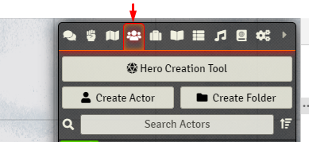

# Hero Creation Tool for Foundry VTT - DnD 5e

### [FAQ](https://github.com/AndrewJiangB/hero-creation-tool/blob/main/docs/FAQ.md)

### [How-To for DMs](https://github.com/AndrewJiangB/hero-creation-tool/blob/main/docs/HOW-TO.md)

### [Changelog](https://github.com/AndrewJiangB/hero-creation-tool/blob/main/docs/CHANGELOG.md)

### [Setup for collaborators](https://github.com/AndrewJiangB/hero-creation-tool/blob/main/docs/DEV-SETUP.md)

### [License](https://github.com/AndrewJiangB/hero-creation-tool/blob/main/docs/LICENSE)

## Setup

The tool can be installed like a regular module, so you can log out of your world, go to Modules > Install Modules and look for it by name.

## The Tool

After installing the module, you will find a new button on top of your Actors' Directory. Clicking it will start the tool, and if it's not simple enough from there, we failed!

